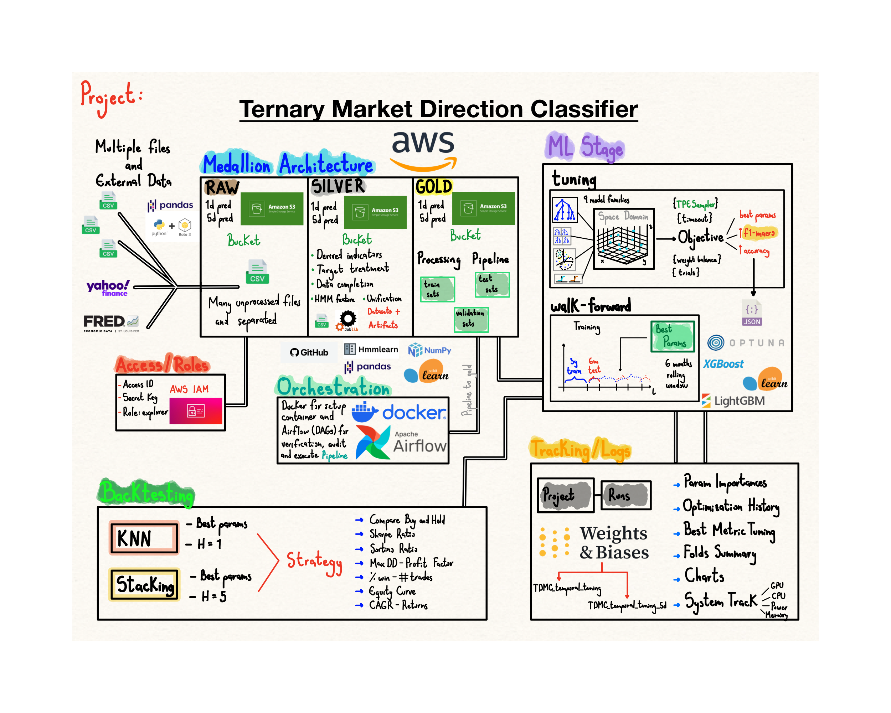
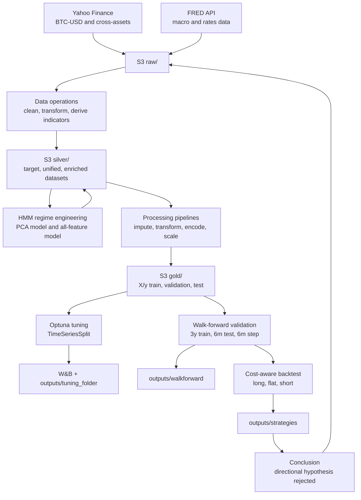
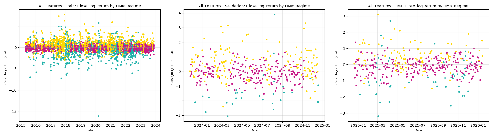
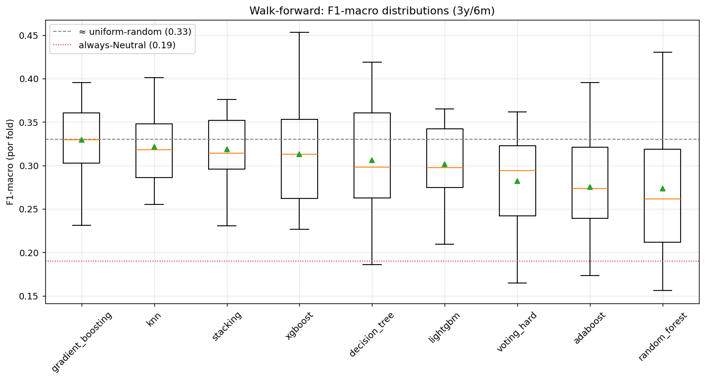
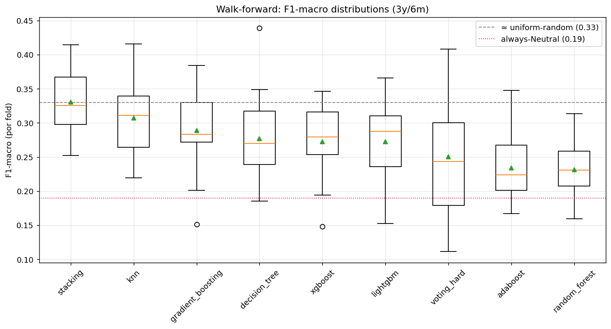
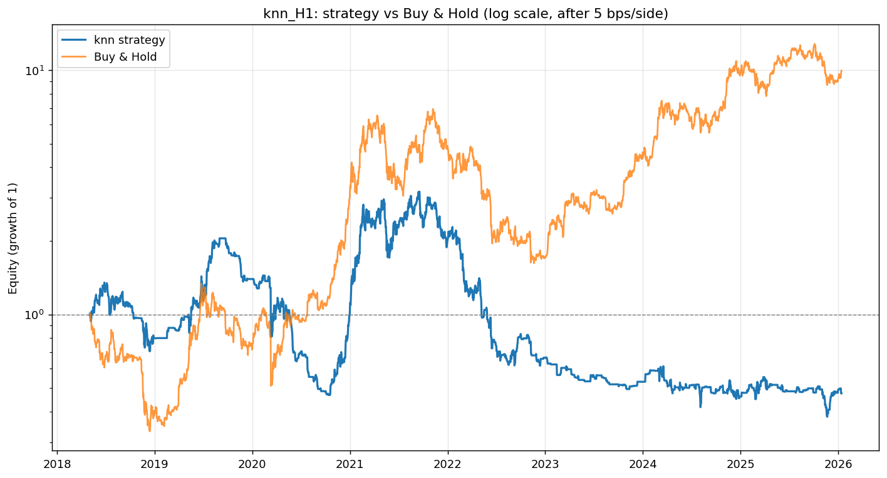
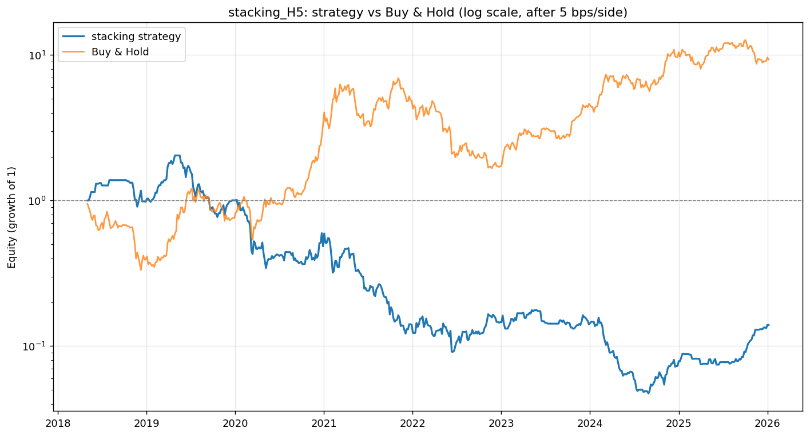

# Ternary Market Direction Classifier

**A research-grade BTC direction classification pipeline with S3 medallion storage, HMM regime features, temporal validation, and cost-aware backtesting.**

TMDC tests whether short-horizon Bitcoin market direction can be predicted as one of three states: `Bearish`, `Neutral`, or `Bullish`. The project runs two parallel prediction horizons: next-day direction (`H = 1`) and 5-day direction (`H = 5`). It starts from market and macro data, builds engineered features, stores intermediate datasets in AWS S3, trains multiple classifiers, validates them through walk-forward testing, and finally asks the only question that matters in trading: does the signal survive transaction costs and beat Buy & Hold?

The final answer is deliberately rigorous: the directional hypothesis is rejected. The models do not show exploitable short-horizon directional edge after temporal validation and cost-aware backtesting. That negative result is the main contribution of the project.

> Research only. This repository is not financial advice, not a trading recommendation, and not a production trading system.

---

## Project Overview



---

## Contents

- [Hypothesis And Objectives](#hypothesis-and-objectives)
- [What Makes This Project Different](#what-makes-this-project-different)
- [Architecture At A Glance](#architecture-at-a-glance)
- [Global Constants And Configuration](#global-constants-and-configuration)
- [Repository Structure](#repository-structure)
- [Methodology, Chronologically](#methodology-chronologically)
- [Full Sequential Workflow](#full-sequential-workflow)
- [Data Storage And Processing](#data-storage-and-processing)
- [Dependencies And Stack](#dependencies-and-stack)
- [Environment Variables](#environment-variables)
- [Outputs](#outputs)
- [Results And Conclusions](#results-and-conclusions)

---

## Hypothesis And Objectives

### Research Hypothesis

BTC short-horizon direction can be predicted from a combined feature set of:

- OHLCV market data.
- Technical indicators.
- Macro and rates variables from FRED.
- Cross-asset prices from Yahoo Finance.
- Crypto market structure indicators.
- Hidden Markov Model regime features.

The prediction must be strong enough to create an exploitable edge after realistic transaction costs.

### Target Definition

The model predicts a ternary class from future return:

```text
Future_Return[t] = (Close[t + H] - Close[t]) / Close[t]
```

| Horizon | Bearish | Neutral | Bullish |
| --- | --- | --- | --- |
| `H = 1` | `Future_Return < -1%` | `-1% <= Future_Return <= +1%` | `Future_Return > +1%` |
| `H = 5` | `Future_Return < -2%` | `-2% <= Future_Return <= +2%` | `Future_Return > +2%` |

Label mapping:

| Class | Numeric Label | Meaning |
| --- | ---: | --- |
| `Bearish` | `0` | Negative forward return beyond the threshold |
| `Neutral` | `1` | Forward return inside the threshold band |
| `Bullish` | `2` | Positive forward return beyond the threshold |

### Objectives

1. Build an S3 data lake for raw, enriched, and ML-ready datasets (Medallion architecture).
2. Engineer technical, statistical, macro, crypto-market, and cross-asset features.
3. Create two clean ternary targets: next-day and 5-day prediction.
4. Add HMM-based market regime features.
5. Prevent look-ahead leakage through strict temporal processing.
6. Tune multiple classifier families with Optuna.
7. Validate models with walk-forward out-of-sample testing.
8. Convert predictions into trading positions and backtest after costs.
9. Decide whether the directional hypothesis is supported or rejected.

---

## What Makes This Project Different

| Feature | Why It Matters |
| --- | --- |
| **Ternary target** | Avoids the oversimplified binary up/down framing by adding a realistic `Neutral` class. |
| **Two horizons** | Tests whether the signal is only absent at 1 day or also absent across a wider 5-day move. |
| **S3 Medallion Architecture** | Separates ingestion, enrichment, and ML-ready data into clear storage layers. |
| **HMM regime features** | Adds latent market-state context using both PCA-based and all-feature HMM variants. |
| **Temporal integrity** | Uses chronological splits, no shuffling, TimeSeriesSplit, and walk-forward validation. |
| **Multiple model families** | Tests simple, tree-based, boosting, nearest-neighbor, and ensemble classifiers. |
| **Cost-aware endpoint** | Does not stop at F1 score. The final judge is trading performance after costs. |
| **Experiment tracking** | Uses Optuna artifacts and W&B runs for tuning and walk-forward evaluation. |

---

## Architecture At A Glance



---

## Global Constants And Configuration

| Category | Value |
| --- | --- |
| Target asset | `BTC-USD` |
| Main data frequency | Daily |
| Date range | `2015-03-07` to `2026-01-15` |
| H = 1 threshold | `+/- 1%` forward return |
| H = 5 threshold | `+/- 2%` forward return |
| Target mapping | `Bearish = 0`, `Neutral = 1`, `Bullish = 2` |
| Train cutoff | `2023-12-31` |
| Validation cutoff | `2024-12-31` |
| Test period | Dates after `2024-12-31` |
| Tuning splitter | `TimeSeriesSplit(n_splits = 5)` |
| Tuning budget | Up to `500` trials per model, `1` hour timeout |
| Primary metric | `F1-macro` |
| Class weighting policy | Custom emphasis on Bearish: `{0: 2, 1: 1, 2: 1}` |
| Walk-forward train window | `3` years |
| Walk-forward test window | `6` months |
| Walk-forward step | `6` months |
| Number of walk-forward folds | `16` valid out-of-sample folds |
| HMM regimes | `3` states |
| PCA retained variance target | `90%` |
| Backtest cost | `5 bps` per side |
| Backtest position mapping | `Bullish -> +1`, `Neutral -> 0`, `Bearish -> -1` |

Important modeling choices:

- The raw `Future_Return` column is used only to create the target and is dropped before modeling.
- Legacy merge index columns such as `Unnamed: 0_x`, `Unnamed: 0_y`, and `Unnamed: 0` are dropped.
- `HMM_Regime_All` is retained as a categorical regime feature.
- `HMM_Regime_PCA` is generated for analysis but dropped before final modeling.
- Encoders and scalers are fitted only on the training split and then applied forward.

---

## Repository Structure

```text
.
|-- README.md
|-- CLAUDE.md
|-- pyproject.toml
|-- requirements.txt
|-- configs/
|   |-- load_enriched_data.py
|   |-- load_enriched_data_5d_pred.py
|   |-- load_unified_data.py
|   `-- load_unified_data_5d_pred.py
|-- src/
|   |-- data-operations/
|   |   |-- 01_data_supply.py
|   |   |-- 02_data_target_supply.py
|   |   |-- 03_derived_indicators.py
|   |   |-- 04_external_data_consolidation.py
|   |   |-- 05_target_var_treatment.py
|   |   |-- 06_financial_assets_processing.py
|   |   |-- 07_fred_data_completion.py
|   |   |-- 08_data_unification.py
|   |   |-- 09_feature_HMM_regime.py
|   |   |-- 10_target_var_treatment_5d_pred.py
|   |   |-- 11_data_unification_5d_pred.py
|   |   `-- 12_feature_HMM_regime_5d_pred.py
|   |-- data-processing/
|   |   |-- processing_pipeline.py
|   |   `-- processing_pipeline_5d_pred.py
|   |-- tuning_training_evaluation/
|   |   |-- temporal_split_tuning.py
|   |   |-- temporal_split_tuning_5d_pred.py
|   |   |-- walk_forward_train_eval.py
|   |   `-- walk_forward_train_eval_5d_pred.py
|   `-- backtesting/
|       `-- models_backtesting.py
|-- airflow/
|   |-- dags/
|   |-- config/
|   `-- docker-compose.yaml
|-- notebooks/
|-- outputs/
|   |-- EDA_content/
|   |-- feature_engineering/
|   |-- objects/
|   |-- tuning_folder/
|   |-- walkforward/
|   `-- strategies/
`-- reports/
    |-- data_dictionary.md
    |-- insights_EDA.md
    |-- insights_ml_approaches.md
    |-- HMM_regime_results.md
    `-- closing_report.md
```

| Path | Role |
| --- | --- |
| `src/data-operations/` | Numbered ingestion, feature engineering, target, unification, and HMM scripts. |
| `src/data-processing/` | Converts enriched silver datasets into ML-ready gold train/validation/test splits. |
| `src/tuning_training_evaluation/` | Hyperparameter tuning and walk-forward evaluation scripts. |
| `src/backtesting/` | Final financial simulation from out-of-sample predictions. |
| `configs/` | Importable S3 data loaders used by processing pipelines. |
| `airflow/` | Dockerized Airflow orchestration setup. |
| `notebooks/` | Exploratory analysis notebooks. |
| `outputs/` | Generated plots, model artifacts, tuning results, walk-forward reports, and strategy results. |
| `reports/` | Written analysis, data dictionary, HMM interpretation, ML insights, and final conclusion. |

---

## Methodology, Chronologically

### 1. Data Ingestion

The project starts by collecting daily BTC and related market data:

- BTC OHLCV data from Yahoo Finance.
- Cross-asset prices such as VIX, gold, oil, TLT, RSP, TNX, IWM, UUP, MSTR, and SPY.
- FRED macro/rates indicators including inflation expectations, yield-curve spreads, credit spreads, effective Fed funds, and financial stress measures.
- External crypto and macro series such as BTC dominance, total crypto market cap, USDT dominance, M2, and Baltic Dry Index.

### 2. Feature Engineering

The pipeline derives market features from BTC OHLCV data:

- Moving-average distance features.
- Momentum features.
- RSI, stochastic oscillator, Williams %R.
- ATR and normalized volatility.
- Bollinger and Keltner channel distances.
- OBV and anchored VWAP.
- Intraday log volatility.
- Relative volume category.
- Day type: accumulation, distribution, or neutral.
- Weekly breakout state.

These features capture price trend, momentum, volatility, volume confirmation, and short-term market structure.

### 3. Target Construction

Two targets are created independently:

- `H = 1`: next-day return classified with a `+/- 1%` band.
- `H = 5`: 5-day return classified with a `+/- 2%` band.

This design tests whether a wider forecast horizon improves directional learnability.

### 4. Dataset Unification

The target data, technical features, macro variables, external crypto series, and cross-asset prices are merged into unified datasets in the S3 silver layer.

Main unified files:

- `silver/data_unified.csv`
- `silver/5d_pred_data_unified.csv`

### 5. HMM Regime Detection

The project trains Gaussian Hidden Markov Models to create latent market-regime features.

Two variants are generated:

- **PCA-based HMM**: dimensionality reduction first, then regime detection.
- **All-feature HMM**: regime detection using the transformed full feature set.

The all-feature HMM is retained for final modeling because it captures more interpretable regime separation. The enriched datasets are written back to silver:

- `silver/data_enriched.csv`
- `silver/5d_pred_data_enriched.csv`

### 6. ML Processing

The processing pipelines convert enriched silver data into gold ML matrices:

- Drop leakage and irrelevant columns.
- Forward-fill temporally appropriate missing values.
- Normalize price-distance features.
- Convert price levels to log returns.
- Convert selected macro series to differences or percentage changes.
- Encode categorical features.
- Scale continuous features with `RobustScaler`.
- Split chronologically into train, validation, and test.

### 7. Hyperparameter Tuning

Optuna runs one study per model family, optimizing F1-macro through `TimeSeriesSplit(5)` on the training set. The project tests nine model families:

1. XGBoost
2. LightGBM
3. Random Forest
4. Gradient Boosting
5. Decision Tree
6. AdaBoost
7. Stacking
8. Hard Voting
9. KNN

Each study logs trial metrics, best parameters, plots, and artifacts.

### 8. Walk-Forward Validation

The tuned models are then evaluated through rolling out-of-sample windows:

```text
3 years train -> next 6 months test -> slide 6 months -> repeat
```

This produces a distribution of out-of-sample performance instead of a single lucky split.

Per-fold metrics include:

- F1-macro.
- Accuracy.
- Per-class precision, recall, and F1.
- Train-vs-test overfit gap.
- One-vs-rest ROC-AUC where probabilities are available.
- PR-AUC.
- Log-loss.
- Brier score.
- Lift over the always-neutral baseline.

### 9. Cost-Aware Backtesting

Out-of-sample predictions are converted into positions:

| Prediction | Position |
| --- | ---: |
| `Bullish` | `+1` long |
| `Neutral` | `0` flat |
| `Bearish` | `-1` short |

The backtest:

- Uses raw Close prices from the enriched silver layer.
- Applies `5 bps` transaction cost per side.
- Compares model strategy equity against Buy & Hold.
- Uses non-overlapping trades for the 5-day horizon.

### 10. Final Synthesis

The project does not stop at model scores. It combines tuning, walk-forward validation, and cost-aware P&L. The conclusion is that the feature set does not contain exploitable short-horizon directional signal for BTC across either tested horizon.

---

## Full Sequential Workflow

Run commands from the repository root with the virtual environment activated.

### 0. Environment Setup

```powershell
env_TMDC\Scripts\activate
pip install -r requirements.txt
pip install -e .
```

The editable install is needed because the processing pipelines import loaders from `configs/`.

### 1. Raw Data Supply

```powershell
python src/data-operations/01_data_supply.py
python src/data-operations/02_data_target_supply.py
```

### 2. Silver Feature Construction For H = 1

```powershell
python src/data-operations/03_derived_indicators.py
python src/data-operations/04_external_data_consolidation.py
python src/data-operations/05_target_var_treatment.py
python src/data-operations/06_financial_assets_processing.py
python src/data-operations/07_fred_data_completion.py
python src/data-operations/08_data_unification.py
python src/data-operations/09_feature_HMM_regime.py
```

### 3. Silver Feature Construction For H = 5

Run after the shared H = 1 data supply and unification foundation exists.

```powershell
python src/data-operations/10_target_var_treatment_5d_pred.py
python src/data-operations/11_data_unification_5d_pred.py
python src/data-operations/12_feature_HMM_regime_5d_pred.py
```

### 4. ML-Ready Processing

```powershell
python src/data-processing/processing_pipeline.py
python src/data-processing/processing_pipeline_5d_pred.py
```

Artifacts:

- `artifacts/processing_artifacts.joblib`
- `artifacts/processing_artifacts_for_5d_pred.joblib`
- Local copies under `outputs/objects/`

### 5. Hyperparameter Tuning

```powershell
python src/tuning_training_evaluation/temporal_split_tuning.py
python src/tuning_training_evaluation/temporal_split_tuning_5d_pred.py
```

W&B tracking:

- One run per model family.
- Trial metrics logged as optimization curves.
- Trial tables and best-parameter artifacts saved.
- Project names are controlled through `WANDB_PROJECT` and `WANDB_PROJECT_5D`.

The previous tokenized public W&B report URL is intentionally not stored in this README. Use your configured W&B entity/project to access the tracked runs securely.

### 6. Walk-Forward Evaluation

```powershell
python src/tuning_training_evaluation/walk_forward_train_eval.py
python src/tuning_training_evaluation/walk_forward_train_eval_5d_pred.py
```

### 7. Cost-Aware Backtesting

```powershell
python src/backtesting/models_backtesting.py
```

Configured experiments:

- `knn_H1`
- `stacking_H5`

### 8. Optional Airflow Orchestration

The repository includes a Dockerized Airflow setup for orchestration work:

```powershell
cd airflow
docker-compose up
```

The DAGs are intended to support source verification, preprocessing execution, and output validation around the S3-backed pipeline.

---

## Data Storage And Processing

The project uses a medallion-style layout in S3.

### S3 Layers

| Layer | Prefix | Contents | Meaning |
| --- | --- | --- | --- |
| Raw | `raw/` | Source downloads from Yahoo Finance, FRED, and external files | Data as close as possible to the provider output. |
| Silver | `silver/` | Cleaned features, target datasets, unified datasets, HMM-enriched datasets | Analyst-ready data with meaningful joins and feature additions. |
| Gold | `gold/` | Encoded/scaled train, validation, and test matrices | Model-ready data. |
| Models | `models/` | HMM artifacts | Regime models and supporting objects. |
| Artifacts | `artifacts/` | Processing pipelines and metadata | Reusable encoders, scalers, mappings, and final feature lists. |

### Key S3 Datasets

| Dataset | Horizon | Layer | Description |
| --- | --- | --- | --- |
| `raw/btc_target_data.csv` | Shared | Raw | BTC OHLCV base series. |
| `silver/data_unified.csv` | H = 1 | Silver | Unified next-day dataset before HMM enrichment. |
| `silver/data_enriched.csv` | H = 1 | Silver | H = 1 dataset with HMM regime features. |
| `silver/5d_pred_data_unified.csv` | H = 5 | Silver | Unified 5-day dataset before HMM enrichment. |
| `silver/5d_pred_data_enriched.csv` | H = 5 | Silver | H = 5 dataset with HMM regime features. |
| `gold/X_train.csv`, `gold/y_train.csv` | H = 1 | Gold | Training features and labels. |
| `gold/X_validation.csv`, `gold/y_validation.csv` | H = 1 | Gold | Validation features and labels. |
| `gold/X_test.csv`, `gold/y_test.csv` | H = 1 | Gold | Test features and labels. |
| `gold/X_train_5d.csv`, `gold/y_train_5d.csv` | H = 5 | Gold | 5-day training features and labels. |
| `gold/X_validation_5d.csv`, `gold/y_validation_5d.csv` | H = 5 | Gold | 5-day validation features and labels. |
| `gold/X_test_5d.csv`, `gold/y_test_5d.csv` | H = 5 | Gold | 5-day test features and labels. |

### Processing Logic

The ML processing pipelines separate transformations into two groups:

| Group | Fit Behavior | Examples |
| --- | --- | --- |
| Base transformations | Applied before the split when stateless or time-causal | Dropping columns, forward-fill, log returns, differences, price normalization. |
| ML transformations | Fitted only on train, then applied to validation/test | Ordinal encoding, one-hot encoding, robust scaling. |

This prevents future data from leaking into fitted preprocessing objects.

---

## Dependencies And Stack

### Setup

```powershell
env_TMDC\Scripts\activate
pip install -r requirements.txt
pip install -e .
```

### Stack By Purpose

| Purpose | Main Libraries / Tools |
| --- | --- |
| Data access and storage | `boto3`, `s3fs`, `yfinance`, `fredapi`, `python-dotenv` |
| Data processing | `pandas`, `numpy`, `pyarrow`, `joblib` |
| Machine learning | `scikit-learn`, `xgboost`, `lightgbm`, `hmmlearn` |
| Tuning and tracking | `optuna`, `wandb` |
| Visualization and reporting | `matplotlib`, `seaborn`, `tabulate` |
| Orchestration | `apache-airflow`, Docker Compose |
| Packaging | `setuptools`, editable install through `pyproject.toml` |

---

## Environment Variables

Create a `.env` file in the repository root. Do not commit credentials.

### AWS And S3

| Variable | Purpose |
| --- | --- |
| `S3_BUCKET_NAME` | Target S3 bucket for raw, silver, gold, models, and artifacts. |
| `AWS_ACCESS_KEY_ID` | AWS access key used by `boto3`. |
| `AWS_SECRET_ACCESS_KEY` | AWS secret key used by `boto3`. |

### Data APIs

| Variable | Purpose |
| --- | --- |
| `FRED_API_KEY` | API key for FRED macroeconomic series. |

### Experiment Tracking

| Variable | Purpose |
| --- | --- |
| `WANDB_API_KEY` | W&B authentication. |
| `WANDB_MODE` | W&B mode, usually `online` or `offline`. |
| `WANDB_ENTITY` | W&B entity/user/team. |
| `WANDB_PROJECT` | W&B project for H = 1 tuning and walk-forward runs. |
| `WANDB_PROJECT_5D` | W&B project for H = 5 tuning and walk-forward runs. |

### Local Output Paths

| Variable | Purpose |
| --- | --- |
| `EDA_CONTENT_PATH` | Local directory for EDA figures. |
| `FT_ENGINEERING_CONTENT_PATH` | Local directory for feature-engineering and HMM plots. |
| `ARTIFACTS_LOCAL_PATH` | Local directory for processing artifacts. |
| `STRATEGIES_PATH` | Local directory for strategy and backtest outputs. |
| `TUNING_PATH` | Local directory for Optuna studies, best params, and tuning plots. |
| `WALKFORWARD_PATH` | Local directory for walk-forward CSVs, summaries, and dashboards. |
| `BACKTEST_PATH` | Optional path used by the backtesting script; defaults to `TUNING_PATH` if unset. |

---

## Outputs

The repository already contains generated outputs that document the full modeling path.

| Directory | Contents |
| --- | --- |
| `outputs/EDA_content/` | Exploratory plots: target balance, missingness, correlations, distributions, SHAP, feature importance. |
| `outputs/feature_engineering/` | HMM regime plots, PCA variance plots, HMM artifacts. |
| `outputs/objects/` | Local processing artifacts such as fitted encoders/scalers and feature metadata. |
| `outputs/tuning_folder/` | Optuna studies, best parameter JSON files, optimization histories, parameter importances. |
| `outputs/walkforward/` | Per-model fold metrics, walk-forward summaries, fold dashboards, F1 distribution boxplots. |
| `outputs/strategies/` | Backtest summaries, equity curves, drawdowns, positions, rolling Sharpe, returns, trade P&L. |

### Selected Visual Artifacts

#### Target Balance


#### HMM Regime Engineering



#### Walk-Forward F1 Distributions





#### Strategy Equity Curves





---

## Results And Conclusions

### 1. Tuning Results

The best cross-validation F1-macro scores were close to random-uniform behavior.

| Horizon | Best Observed Tuning Result | Interpretation |
| --- | ---: | --- |
| H = 1 | About `0.360` F1-macro | Slightly above the random-uniform floor, not strong evidence of signal. |
| H = 5 | About `0.340` F1-macro | Also near the random-uniform floor. |

The important baseline is not only the always-neutral classifier. Because the task has three classes, a random uniform predictor sits around `0.33` F1-macro. A model must clear that level consistently and out-of-sample to show credible directional signal.

### 2. Walk-Forward Validation

Walk-forward validation produced 16 out-of-sample folds using rolling windows:

```text
3 years train -> 6 months test -> slide 6 months
```

The main findings:

- ROC-AUC clustered near chance across models and horizons.
- F1-macro stayed close to the random-uniform threshold.
- Flexible models often showed large train-test gaps, which indicates memorization rather than stable signal.
- Models that beat the always-neutral baseline did not necessarily beat the more meaningful random-uniform reference.
- Bearish recall remained difficult, consistent with the structurally bullish sample period.

### 3. Backtesting Results

The backtest is the final verdict because it converts out-of-sample predictions into positions and applies trading costs.

Source: `outputs/strategies/backtest_summary.json`

| Strategy | Horizon | Total Return | Sharpe | Buy & Hold Return | Buy & Hold Sharpe | Verdict |
| --- | --- | ---: | ---: | ---: | ---: | --- |
| `knn_H1` | H = 1 | `-52.54%` | `0.08` | `+894.77%` | `0.795` | Fails to beat Buy & Hold. |
| `stacking_H5` | H = 5 | `-86.03%` | `-0.191` | `+832.15%` | `0.782` | Fails to beat Buy & Hold. |

The H = 1 strategy lost more than half of capital while Buy & Hold rose almost 9x over the same out-of-sample prediction period. The H = 5 strategy performed even worse. Transaction costs hurt, but the core issue is not only cost drag: the models do not rank or classify future direction well enough.

### 4. Weights and Biases Report

[Report Link](https://wandb.ai/buitragopablo19-upb-bogot-/TMDC_temporal_tuning/reports/TMDC-Report--VmlldzoxNzM1MjM0MA?accessToken=76ed8n9w9wq6z9d3yfkatqrhmccjcfobenlt5vqudnkgtfs7lszdmfwsgzug6ead)

---

### Final Conclusion

The hypothesis that BTC short-horizon direction is exploitably predictable from this feature set is rejected.

That is not a failed project. It is a valid research result:

- The data was processed through a reproducible S3 architecture.
- Leakage sources were identified and removed.
- The validation design respected time.
- Multiple model families were tested.
- Performance was measured out-of-sample.
- The final endpoint was cost-adjusted P&L, not an in-sample score.

The strongest insight is that this feature set is more promising for **volatility, market regime, and risk-state detection** than for direct short-horizon BTC direction prediction. The HMM work suggests that regimes are learnable; the classifier results show that next-direction edge is not.

---

## Related Reports

- `reports/data_dictionary.md`: feature definitions and data sources.
- `reports/insights_EDA.md`: exploratory analysis and feature behavior.
- `reports/HMM_regime_results.md`: regime-model interpretation.
- `reports/insights_ml_approaches.md`: tuning and walk-forward analysis.
- `reports/closing_report.md`: final hypothesis verdict.