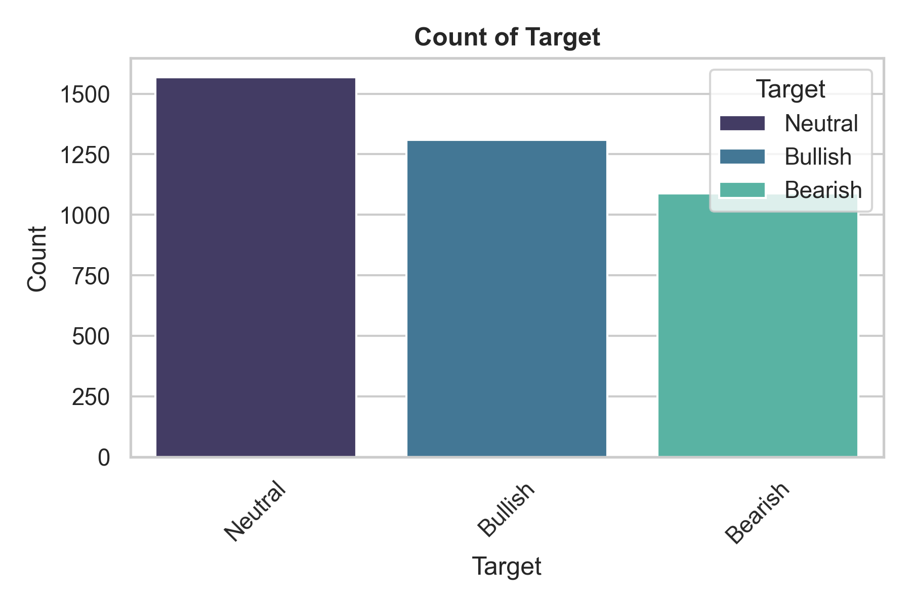
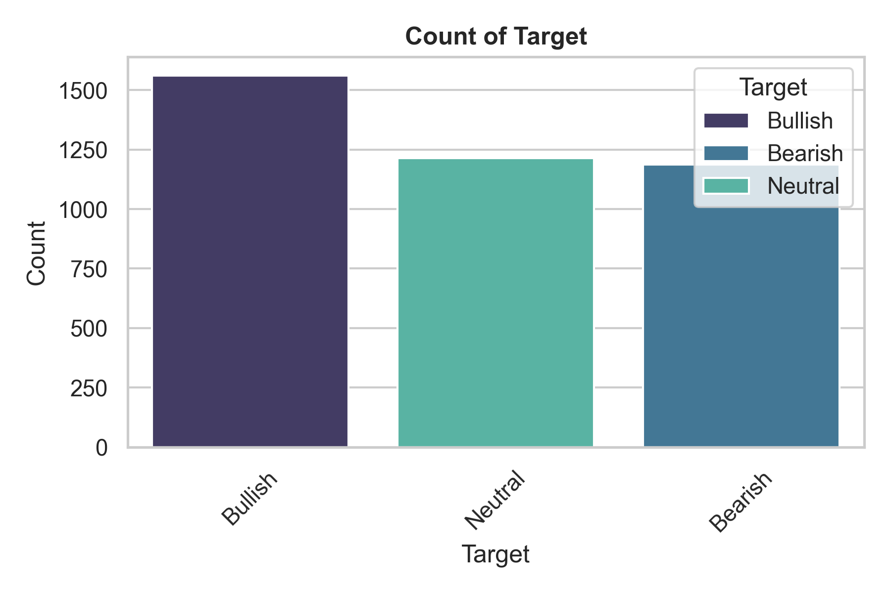

# Closing Report: Directional Hypothesis

* **Hypothesis Tested**: BTC price direction → Bearish (0), Neutral (1), Bullish (2) can be predicted from the engineered feature set with enough edge to be exploitable after cost.

* **Horizons Tested**: 1 day and 5 days

**Evidence/Prodicts**: 

- Hyperparameter Tuning
- Walk-forward Validation
- Cost-aware Backtest

## 1. Why this report exists

Short-horizon directional forecasting of a liquid, heavily arbitraged asset like Bitcoin is, by both theory (Market Efficiency) and the broad empirical record, close to a random walk. The goal of this project was never to assume an edge exists but to test rigorously whether one does and critically, to take the test all the way to its only meaningful endpoint: profit-and-loss after costs, not an in-sample classification score. Most modelling efforts stop at an F1 of aproximately 0.36 and mistake it for signal. This project went the full distance.

## 2. Target Definition

The target labels the sign of the forward return over horizon `H`, where `H` is 1 or 5.

`Future_Return[t] = (Close[t + H] - Close[t]) / Close[t]`

The label is defined as:

`Target[t] = `  `Bearish` (0) if `Future_Return[t] < -0.01`
`Target[t] = ` `Neutral` (1) if `-0.01 <= Future_Return[t] <= 0.01`
`Target[t] = ` `Bullish` (2) if `Future_Return[t] > 0.01`

For H = 1, the thresholds are: Bearish = -1%, Neutral = -1% to +1%, Bullish = +1%.
For H = 5, the thresholds are: Bearish = -2%, Neutral = -2% to +2%, Bullish = +2%.

## 2. The Class Balance Challenge

* **Rows:** aproximately 3.900 daily observations
* **Span:** from 2015 to 2026 → it covers multiple regimes, but dominated by a structurally bullish trend, anomalous post-2020 macro period. 

This coincides with the central bank liquidity injections (quantitative easing) along with the post-pandemix recovery, which has been a tailwind for BTC and other risk assets. 

* With H = 1, the class balance is:

| Class   | Label | Share |
| ------- | ----- | ----- |
| Neutral |   1   | 39.5% |
| Bullish |   2   | 33.0% |
| Bearish |   0   | 27.5% |

* With H = 5, the class balance is:

| Class   | Label | Share |
| ------- | ----- | ----- |
| Neutral |   1   | 30.6% |
| Bullish |   2   | 39.4% |
| Bearish |   0   | 30.0% |

* Reference Baselines

| Baseline                        | Accuracy | F1-Macro |
| ------------------------------- | -------- | -------- |
| Always-Neutral (Majority Class) |    0.395 |    0.190 |
| Random Uniform (1/3 each class) |    0.333 |    0.330 |

The always-majority baseline gives a deceptively low F1-macro (~0.19) because it scores zero on two of three classes. The honest bar for "the model learned something" is F1-macro ≈ 0.33 (random uniform), not 0.19.

## 3. Experimental design

A three-stage funnel, applied independently to each horizon:

#### 3.1. Hyperparameter Tuning

With Optuna (TPE), 9 model families, up to 500 trials each (1 hour timeout), TimeSeriesSplit(5) inside the objective, F1-macro as the optimized metric, custom class weights {Bearish:2, Neutral:1, Bullish:1}. Tracked in Weights & Biases.

#### 3.2. Walk-forward Validation

With rolling windows of 3 years train → 6 months test, sliding 6 months → 16 contiguous out-of-sample folds spanning ~2018–2026. Per fold: F1-macro, accuracy, per-class precision/recall/F1, train-vs-test overfitting gap, and (where available) one-vs-rest ROC-AUC, PR-AUC, log-loss, Brier.

#### 3.3. Cost-aware Backtest

With out-of-sample predictions mapped to positions (Bullish → long, Neutral → flat, Bearish → short), traded with transaction costs (5 bps/side) against a Buy & Hold benchmark; multi-day horizons traded without overlap (hold H days, step H days).

Temporal integrity was enforced throughout: no shuffling anywhere. Validation always tests on data strictly after training.

## 4. Stage 1: Hyperparameter Tuning Results

Best CV F1-macro per model (TimeSeriesSplit with 5 flods):

| Model             | F1-macro (H = 1) | F1-macro (H = 5) |
|-------------------|------------------|------------------|
| KNN               | 0.360            | 0.328            |
| AdaBoost          | 0.357            | 0.340            |
| Decision Tree     | 0.352            | 0.338            |
| LightGBM          | 0.347            | 0.295            |
| Stacking          | 0.329            | 0.325            |
| Random Forest     | 0.321            | 0.267            |
| XGBoost           | 0.318            | 0.280            |
| Gradient Boosting | 0.311            | 0.269            |
| Voting (Hard)     | 0.303            | 0.318            |

* At both horizons, the best model sits essentially on the random-uniform floor. 

* The simpliest models beat the complex ones; shallow trees, AdaBoost, XGBoost topped the gradient boosters. It basically means that flexible models overfit noise.

## 5. Stage 2: Walk Forward Validation

Mean across 16 out of sample folds (3 years train/ 6 months test). ROC-AUC (one-vs-rest, threshold- and balance-independent) is the cleanest measure of ranking skill. Only most notable are shown.

With H = 1:

| Modelo              | F1-macro | ROC-AUC | Overfit gap | Beats baseline |
|---------------------|----------|---------|-------------|----------------|
| Gradient Boosting   | 0.330    | 0.539   |    0.639    |      100%      |
| KNN                 | 0.322    | 0.532   |    0.162    |      100%      |
| Stacking            | 0.319    | 0.499   |    -0.070   |      100%      |
| XGBoost             | 0.313    | 0.534   |    0.603    |      100%      |
| LightGBM            | 0.302    | 0.537   |    0.512    |      100%      |
| Random Forest       | 0.274    | 0.559   |    0.261    |      88%       |

With H = 5: 

| Modelo              | F1-macro | ROC-AUC | Overfit gap | Beats baseline |
|---------------------|----------|---------|-------------|----------------|
| Stacking            | 0.331    | 0.510   |    -0.113   |      100%      |
| KNN                 | 0.307    | 0.489   |    0.268    |      100%      |
| Gradient Boosting   | 0.289    | 0.521   |    0.693    |      94%       |
| Decision Tree       | 0.277    | 0.507   |    0.456    |      94%       |
| XGBoost             | 0.273    | 0.517   |    0.685    |      88%       |
| Random Forest       | 0.232    | 0.535   |    0.400    |      88%       |

* ROC-AUC is at chance everywhere. Every model at both horizons lands in 0.49–0.56. At H=5, KNN actually drops below chance (0.489). The ability to rank days by directional probability is effectively nil.

* "Beats baseline 100%" is a trap, not a triumph. The baseline is always-majority (F1-macro ~0.19 by construction); any model that spreads predictions across three classes clears it trivially. Against the correct bar (random uniform ≈ 0.33), no model clears it at either horizon.

* The F1 ranking rewards overfitting not skill. Gradient Boosting and XGBoost post the largest gaps, they memorized the noise. The cleanest id the Stacking, the only model that genuinely generalize (gap < 0). 

* Class recalls reveal regime memorization, not skill. Bullish recall dominates while Neutral recall collapses — the models are learning "this goes up" from the structurally bullish sample, not detecting direction.

## 6. Stage 3: Backtest

Out of sample predictions traded with 5 bps/side costs against Buy and Hold reference strategy.

| Métrica              | KNN (H = 1)   | Stacking (H = 5) | Buy & Hold     |
|----------------------|---------------|------------------|----------------|
| Total return         | -52.5%        | -86.0%           | +832% to +895% |
| CAGR                 | -9.2%         | -22.6%           | +34%           |
| Sharpe               | 0.08          | -0.19            | 0.79           |
| Sortino              | 0.08          | -0.23            | —              |
| Max drawdown         | -88.0%        | -97.7%           | -76.0%         |
| Win rate             | 27.4%         | 38.3%            | —              |
| Profit factor        | 1.02          | 0.93             | —              |
| Exposure             | 54.9%         | 73.7%            | 100%           |
| Trades               | 809           | 3091             | —              |
| Cumulative cost drag | -53.8%        | -22.5%           | 0              |

* The strategies destroy capital in absolute terms. While BTC rose almost 9x over the period, the models turned capital into a 53% - 86% loss. This is much much lower than expected for a buy and hold strategy.

* They do so with more risk than simply holding. Max drawdowns of 88% and 98% exceed Buy & Hold's 76%. More risk, negative return, meaning the worst of both worlds.

* Methodological note (shorting). The backtest allowed shorts (Bearish → short). In a structurally bullish sample this amplifies losses. A long/flat-only variant would lose less brutally but still fails to beat Buy & Hold — the underlying "no signal" conclusion is unchanged.

* Costs alone would not explain such a large underperformance, the cumulative cost drag is around -53.8% for KNN and -22.5% for Stacking. But the main issue is the model's inability to predict the direction of the market.

## 7. Synthesis 

| Stage                          | H = 1        | H = 5         | Conclusion                  |
|------------------------------  |--------------|---------------|-----------------------------|
| Tuning (best F1-macro)         | 0.360        | 0.340         | At the random-uniform floor |
| Walk-forward (best ROC-AUC)    | 0.559        | 0.535         | Ranking at chance           |
| Backtest (best Sharpe vs B&H)  | 0.08 vs 0.80 | -0.19 vs 0.78 | Loses money, trails B&H     |

This is fully consistent with the project's own earlier EDA (feature lifts of only ~1.2×, Bearish near-unpredictable) and with efficient-market evidence that short-horizon direction of a liquid asset approximates a random walk.

##### Equity Curve KNN Strategy  (H = 1)

##### Equity Curve Stacking Strategy  (H = 5)

## 8. Why this is a valid result, not a failure

A correctly measured "no edge" answers the research question definitively. The value of this project is not a profitable model — it is a rigorously established negative, obtained by avoiding every common trap:

* Temporal validity — no shuffling; walk-forward across 16 regimes.
* Honest metric — F1-macro (not accuracy) against the correct baseline (random uniform, not always-majority).
* Leakage control — index/cumulative leaks identified and removed in EDA; target's forward-looking nature respected.
* The endpoint that matters — cost-aware P&L versus Buy & Hold, not an in-sample score.

## 9. Bottom line

The hypothesis that BTC short-horizon direction is exploitably predictable from this feature set was tested at two horizons, with nine model families, under temporal walk-forward validation, and measured in cost-adjusted profit and loss. It is rejected. The strategies rank at chance and lose money relative to holding the asset. The project's next chapter should target volatility/regime, where the HMM has already demonstrated real, learnable structure.

Thanks for reading it,

Pablo.